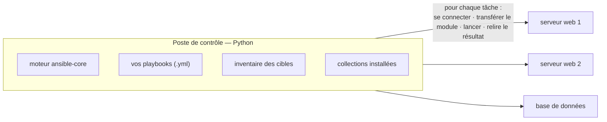

# 0 — Ansible : installation & concepts

Bienvenue au **Jour 3**. En J2, **Terraform a provisionné** l'infrastructure (les conteneurs) et
a **écrit l'inventaire**. Aujourd'hui, **Ansible configure** ce qui a été provisionné — et on
boucle la chaîne GitOps : *provisionner (TF) → configurer (Ansible)*.

> **Le fil rouge.** On a une appli WordPress (J2). En J3, on la complète côté **ops** : on
> déploie et configure un **reverse proxy (HAProxy)** devant, avec Ansible. Puis on assemble le
> **capstone** : un pipeline qui provisionne **et** configure, de bout en bout.

### Ressources utiles

- [Documentation Ansible](https://docs.ansible.com/ansible/latest/) ·
  [Modules built-in](https://docs.ansible.com/ansible/latest/collections/ansible/builtin/) ·
  [Collection `community.docker`](https://docs.ansible.com/ansible/latest/collections/community/docker/)

---

## Qu'est-ce qu'Ansible ?

**Ansible** est un outil de **gestion de configuration** : on décrit l'**état voulu** d'une
machine (paquets installés, services démarrés, fichiers en place) dans des **playbooks**, et
Ansible l'applique.

| Notion | Définition |
|---|---|
| **Agentless** | aucun agent à installer sur les cibles — Ansible s'y connecte (SSH ou autre) |
| **Push** | c'est le poste de contrôle qui **pousse** la config vers les cibles |
| **Idempotent** | rejouer un playbook ne change rien si l'état est déjà bon (`changed=0`) |
| **Déclaratif (tasks)** | on décrit le résultat (paquet *présent*, service *démarré*), pas les commandes |
| **Inventory** | la liste des machines à configurer (+ leurs variables) |

> **Terraform vs Ansible.** Terraform **provisionne** l'infra (créer des conteneurs, des VM, des
> réseaux). Ansible **configure** l'intérieur (installer, paramétrer, déployer). Les deux sont
> complémentaires : TF crée la boîte, Ansible la remplit. C'est le combo classique du GitOps.
> *(Et aujourd'hui le périmètre d'Ansible **évolue** : au-delà de la config de serveurs, il pilote
> aussi du réseau, du cloud, du Windows, des conteneurs… cf. plus bas.)*

---

## Architecture & composants

Ansible est écrit en **Python** et fonctionne **sans serveur central** : tout part d'un **poste
de contrôle** (*control node*) qui **pousse** la configuration vers les cibles.



**Les briques à connaître :**

| Composant | À quoi ça sert |
|---|---|
| **Poste de contrôle** *(control node)* | la machine d'où l'on **lance** Ansible (votre poste, ou un runner CI). Tourne en **Python**. |
| **ansible-core** | le moteur qui interprète vos playbooks et orchestre l'exécution sur les cibles |
| **Playbook** | votre fichier `.yml` qui décrit **ce qu'il faut faire** (les tâches) et **où** |
| **Inventaire** | la **liste des cibles** à configurer, avec leurs variables |
| **Module** | la brique d'action concrète (`apt`, `service`, `copy`…), **transférée puis exécutée sur la cible** |
| **Plugin** | un point d'extension d'Ansible — dont le **plugin de connexion** (la façon de joindre la cible) |
| **Collection** | un ensemble distribuable de modules + plugins (par ex. `community.docker`) |

> **Le déroulé d'une tâche, en clair :** le poste de contrôle ouvre une **connexion** vers la
> cible, lui **transfère** le module nécessaire, le **lance** sur place, puis **relit le
> résultat** (renvoyé en JSON). Aucun service n'est laissé sur la cible (**agentless**) — mais
> le module ayant besoin de **Python** pour tourner, la cible doit en disposer (on gère ce cas
> en [1](1-FIRST-PLAYBOOK.md)).

---

## La notion clé : le *connection plugin*

Ansible se connecte à chaque cible via un **plugin de connexion**. Le playbook reste **le même** ;
seule la **connexion** change selon la cible. C'est ce qui fait la portée d'Ansible : il ne
configure pas que des serveurs Linux.

| Cible | Connexion | Exemple d'usage ops |
|---|---|---|
| **VM / serveur réel** (ex. EC2) | `ssh` *(défaut)* | `ansible_host=… ansible_user=… ansible_ssh_private_key_file=…` |
| **Conteneur Docker** *(notre lab)* | **`community.docker.docker`** | `ansible_connection=community.docker.docker` — **sans SSH** |
| **Équipement réseau** (Cisco, Arista…) | `network_cli` / `httpapi` | configurer des **switchs / routeurs** comme du code (collections `cisco.ios`, `arista.eos`…) |
| **Windows** | `winrm` / `psrp` | parc **mixte** : Ansible gère aussi Windows |
| **Pod Kubernetes** | `kubectl` (`kubernetes.core`) | exécuter **dans un pod** |
| **Poste de contrôle lui-même** | `local` | tâches locales (générer des fichiers, appeler une API cloud) — utile en CI |

> **L'idée clé :** le playbook décrit l'**intention** ; le **plugin de connexion** s'adapte à la
> cible (serveur, conteneur, switch, Windows, pod…).
>
> Notre lab cible des **conteneurs** (`community.docker`, **sans SSH**). Le **même playbook**
> fonctionnerait contre un vrai serveur en passant la connexion en `ssh` (variante « serveur
> réel »).

> **Pourquoi `docker` (sans SSH) dans le lab ?** Pas de serveur SSH à installer dans les images,
> pas de clés à gérer : Ansible exécute ses tâches **directement dans le conteneur** via l'API
> Docker. C'est la cible de nos environnements à la demande (provisionnés par TF en J2).

---

## Etape — Installer Ansible

Ansible est déjà présent sur votre poste (code-server). Vérifier :

```bash
ansible --version
# ansible [core 2.1x.x] …
```

> *(Sinon, selon votre environnement, voir la doc officielle :
> [Installing Ansible](https://docs.ansible.com/ansible/latest/installation_guide/intro_installation.html)
> — pip/pipx, paquets de distribution, etc.)*

---

## Utilisation d'Ansible

Avant de lancer quoi que ce soit, le **vocabulaire de base** qu'on va manipuler tout le J3 :

| Terme | En une phrase |
|---|---|
| **Inventaire** | la **liste des cibles** (hôtes/groupes) et leurs variables — le *« où »* |
| **Tâche** *(task)* | une action unitaire (« installer Apache », « copier ce fichier ») via un **module** |
| **Play** | un ensemble de tâches appliqué à un **groupe de cibles** de l'inventaire |
| **Playbook** | un fichier `.yml` qui contient un ou plusieurs *plays* — votre « recette » |
| **Module** | l'outil qui réalise la tâche (`apt`, `service`, `copy`…) |
| **Rôle** | un playbook **factorisé et réutilisable** (vu en [4](4-ROLES.md)) |
| **Collection** | un paquet **téléchargeable** qui apporte des modules + plugins supplémentaires |

> **Deux façons de lancer Ansible :**
> - **ad-hoc** — une seule tâche en ligne de commande : `ansible <groupe> -m <module>` (pratique
>   pour tester, ex. un `ping`) ;
> - **playbook** — on **écrit** les tâches dans un `.yml` et on l'exécute : `ansible-playbook mon.yml`
>   (c'est l'usage normal, versionnable dans git).

> **Les collections.** Ansible-core fournit les modules de base (`ansible.builtin.*`). Le reste
> vit dans des **collections** à installer via **Ansible Galaxy** (le « registre » des
> collections). On en a justement besoin d'une pour parler aux conteneurs.

---

## Etape — Installer la collection `community.docker`

Notre connexion vers les **conteneurs** est fournie par la collection `community.docker` :

```bash
ansible-galaxy collection install community.docker
ansible-galaxy collection list | grep community.docker
```

> Elle est déjà installée sur les postes du lab. On revient sur les collections (et les rôles)
> au chapitre [4](4-ROLES.md).

---

## Etape — Un premier `ping` (connexion docker)

On vérifie qu'Ansible **joint un conteneur** sans SSH. D'abord une cible à joindre :

```bash
# un conteneur de test (avec python — on traitera le cas SANS python en 1)
docker run -d --name test-target python:3.12-slim sleep infinity
```

Un inventaire minimal `inventory.ini` :

```ini
[demo]
test-target ansible_connection=community.docker.docker
```

> **🧪 Manip — ping → pong**
>
> ```bash
> ansible -i inventory.ini demo -m ping
> ```
> Résultat attendu :
> ```
> test-target | SUCCESS => { "ping": "pong" }
> ```
>
> *Observation : Ansible est entré dans le conteneur **sans SSH** (via la connexion `docker`) et
> a répondu `pong`. C'est la mécanique que tout le J3 va utiliser.*

Nettoyage :

```bash
docker rm -f test-target
```

---

## Recap

- Ansible = **gestion de configuration** : agentless, push, **idempotent**, déclaratif.
- **Terraform provisionne, Ansible configure** (complémentaires).
- La **connexion** s'adapte à la cible : `ssh` (serveur réel) ou **`community.docker`**
  (conteneur, **sans SSH**) — *le playbook ne change pas*.
- `ping → pong` validé contre un conteneur.

➡️ **[1 — Premier playbook : fichier, service, Apache](1-FIRST-PLAYBOOK.md)**
