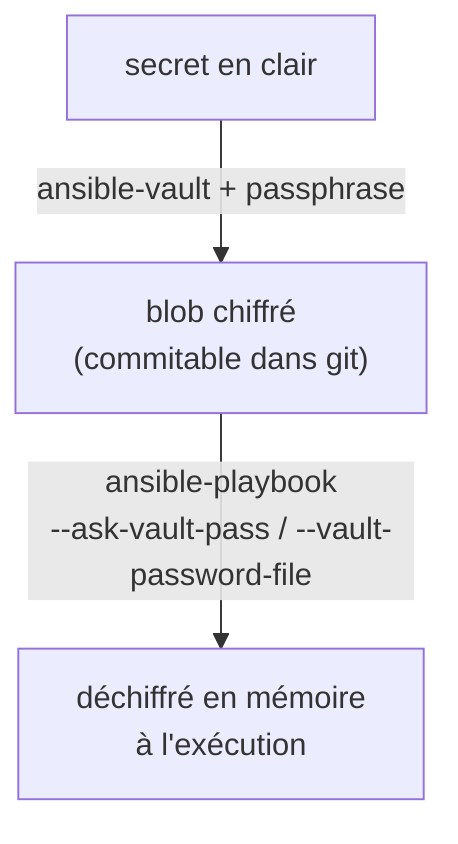

# 3 — Les secrets : Ansible Vault

Suite de [2](2-VARS-TEMPLATES-HANDLERS.md). On a paramétré nos configs avec des
variables… mais certaines sont **sensibles** (mot de passe de base de données, token d'API).
Les mettre **en clair** dans le repo (ou dans le `tfstate`, comme on l'a **volontairement
reporté en J2**) est inacceptable. La réponse côté Ansible : **Ansible Vault**.

> **Rappel J2.** On avait laissé filer les secrets (« on verra ça proprement en J3 »). Nous y
> voilà : Ansible Vault permet de **chiffrer les variables sensibles directement dans le repo**.

### Ressources utiles

- [Ansible Vault](https://docs.ansible.com/ansible/latest/vault_guide/index.html) ·
  [CLI `ansible-vault`](https://docs.ansible.com/ansible/latest/cli/ansible-vault.html) ·
  [Protéger des variables sensibles](https://docs.ansible.com/ansible/latest/vault_guide/vault_encrypting_content.html)

---

## Le principe

**Ansible Vault** chiffre des données (variables ou fichiers entiers) avec une **passphrase**.
Le contenu chiffré est **versionnable dans git** sans risque ; au moment de l'exécution,
Ansible le **déchiffre à la volée** si on lui fournit le mot de passe.



> **À retenir :** ce qui est dans git est **chiffré** ; le **mot de passe du vault**, lui, n'est
> **jamais** commité (il vit ailleurs : saisi à la main, dans un fichier gitignoré, ou une
> variable CI masquée).

---

## Chiffrer une valeur — `encrypt_string`

Le plus simple : chiffrer **une seule variable** et la coller dans un fichier de vars.

```bash
ansible-vault encrypt_string 'S3cr3t-DB-Pwd' --name 'db_password'
```

Sortie (à coller dans `group_vars/web.yml`, par ex.) :

```yaml
db_password: !vault |
          $ANSIBLE_VAULT;1.1;AES256
         66386439653...   (blob chiffré)
         3962303...
```

> Le tag **`!vault`** indique à Ansible que la valeur est chiffrée. On l'utilise ensuite
> **exactement comme une variable normale** (`{{ db_password }}` dans un template) — Ansible la
> déchiffre au moment voulu.

---

## Chiffrer un fichier entier

Pour un fichier qui ne contient **que** des secrets :

```bash
ansible-vault create   secrets.yml      # crée + ouvre un éditeur, sauve chiffré
ansible-vault edit     secrets.yml      # rééditer
ansible-vault view     secrets.yml      # voir en clair (sans modifier)
ansible-vault encrypt  existant.yml     # chiffrer un fichier déjà écrit
ansible-vault decrypt  secrets.yml      # déchiffrer (à éviter : ça remet en clair)
ansible-vault rekey    secrets.yml      # changer la passphrase
```

> **Convention pratique :** garder les secrets dans un fichier dédié (ex.
> `group_vars/web/vault.yml`) et les variables non sensibles à côté
> (`group_vars/web/vars.yml`). On voit du chiffré uniquement là où il faut.

---

## Exécuter un playbook qui utilise un secret

Reprenons le template de config de [2](2-VARS-TEMPLATES-HANDLERS.md) ; il référence
`{{ db_password }}` (désormais chiffré). À l'exécution, on fournit le mot de passe du vault :

```bash
# Option 1 — saisie interactive
ansible-playbook -i inventory.ini site.yml --ask-vault-pass

# Option 2 — via un fichier (gitignoré !) contenant la passphrase
echo "ma-passphrase-vault" > .vault-pass        # /!\ à mettre dans .gitignore
ansible-playbook -i inventory.ini site.yml --vault-password-file .vault-pass
```

### 🧪 Manip — un secret Vault qui protège une page

On reprend le **serveur Apache de [2](2-VARS-TEMPLATES-HANDLERS.md)** et on **protège la
page par mot de passe** (HTTP Basic Auth, via `.htaccess`). Le mot de passe sera un **secret
chiffré dans le vault** — donc concret : il **garde réellement** l'accès à la page.

**1) Chiffrer le mot de passe** dans `group_vars/web.yml` :

```bash
ansible-vault encrypt_string 'S3cr3t-Pwd' --name 'admin_password' >> group_vars/web.yml
```

**2) Le template `.htaccess`** — `templates/htaccess.j2` :

```jinja
AuthType Basic
AuthName "Zone protégée"
AuthUserFile /etc/apache2/.htpasswd
Require valid-user
```

**3) Les tâches** (à ajouter au play) — créer l'identifiant htpasswd (mot de passe = secret
Vault), déployer le `.htaccess`, autoriser les `.htaccess` :

```yaml
- name: Dépendances (passlib pour htpasswd)
  ansible.builtin.apt: { name: python3-passlib, state: present }

- name: Créer l'utilisateur htpasswd (mot de passe = secret Vault)
  community.general.htpasswd:
    path: /etc/apache2/.htpasswd
    name: admin
    password: "{{ admin_password }}"     # ← déchiffré depuis le vault à l'exécution

- name: Déployer le .htaccess
  ansible.builtin.template:
    src: templates/htaccess.j2
    dest: /var/www/html/.htaccess

- name: Autoriser les .htaccess (AllowOverride)
  ansible.builtin.replace:
    path: /etc/apache2/apache2.conf
    regexp: '(<Directory /var/www/>\n\s+Options.*\n\s+)AllowOverride None'
    replace: '\1AllowOverride All'
  notify: Recharger Apache
```

**4) Exécuter — l'échec, puis le succès :**

```bash
ansible-playbook -i inventory.ini site.yml                      # → ÉCHEC : secret chiffré, pas de mot de passe vault
ansible-playbook -i inventory.ini site.yml --ask-vault-pass     # → OK
```

**5) Vérification : chiffré dans le repo, mais fonctionnel sur la cible :**

```bash
grep -A1 admin_password group_vars/web.yml          # → $ANSIBLE_VAULT… (chiffré dans git)
docker exec web1 curl -s -o /dev/null -w '%{http_code}\n' localhost   # → 401 (refusé)
docker exec web1 curl -s -u admin:S3cr3t-Pwd localhost | head -1      # → la page (auth OK)
```

> *Observation : le secret est **chiffré dans le repo**, **déchiffré seulement à l'exécution**,
> et il **protège vraiment** la page. Le mot de passe du vault, lui, n'est
> **jamais** commité.*

---

## Vault dans la CI (GitLab)

Dans un pipeline, on ne saisit rien à la main : on stocke la **passphrase du vault** dans une
**variable CI/CD masquée** (`Settings > CI/CD > Variables`, ex. `ANSIBLE_VAULT_PASSWORD`),
puis :

```yaml
# extrait .gitlab-ci.yml
ansible:configure:
  script:
    - echo "$ANSIBLE_VAULT_PASSWORD" > .vault-pass
    - ansible-playbook -i inventory.ini site.yml --vault-password-file .vault-pass
  after_script:
    - rm -f .vault-pass        # ne pas laisser traîner le secret
```

> Le **contenu chiffré** est dans le repo (sans danger) ; le **mot de passe** vient d'une
> variable CI **masquée**, jamais dans git.

---

## Ouverture — HashiCorp Vault

Ansible Vault chiffre des secrets **statiques** dans **votre** repo. À plus grande échelle, on
centralise avec **HashiCorp Vault** — un **serveur de secrets** dédié :

| | **Ansible Vault** | **HashiCorp Vault** |
|---|---|---|
| Nature | chiffrement de fichiers/variables **dans le repo** | **serveur** centralisé de secrets |
| Secrets | **statiques** (vous les écrivez) | statiques **et dynamiques** (générés à la demande, ex. un identifiant DB temporaire) |
| Accès | une passphrase | politiques, rôles, audit, **rotation**, TTL |
| Portée | par projet | toute l'organisation |

> **HashiCorp Vault = le pas suivant.** Quand les secrets se multiplient (plusieurs équipes,
> rotation, audit), Ansible peut **lire ses secrets depuis HashiCorp Vault** au lieu de les
> stocker chiffrés en local (lookup `community.hashi_vault`). C'est l'évolution naturelle vers
> une gestion d'entreprise des secrets.

---

## Recap

- **Ansible Vault** = chiffrer des secrets **dans le repo** (variable via `encrypt_string`, ou
  fichier via `create`/`encrypt`).
- Le **contenu chiffré** est commitable ; la **passphrase** ne l'est **jamais** (saisie,
  fichier gitignoré, ou **variable CI masquée**).
- À l'exécution : `--ask-vault-pass` ou `--vault-password-file`.
- **C'est la réponse aux secrets reportés en J2.**
- **HashiCorp Vault** = l'étape d'après (serveur centralisé, secrets dynamiques, rotation).

➡️ **[4 — Structurer avec les rôles](4-ROLES.md)**
