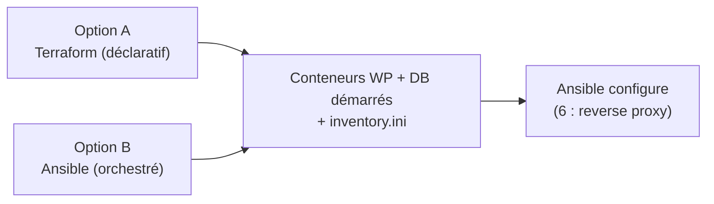

# 5 — Deux façons de monter les conteneurs (Terraform vs Ansible)

Suite de [4](4-ROLES.md). On sait **configurer** une cible avec Ansible. Mais avant de
configurer une ressource cible, il faut la **créer**. Ansible est **aussi** capable de créer des
ressources, tout comme **Terraform** (vu en J2). Ce chapitre les met **côte à côte** : deux
projets qui produisent **le même résultat**, pour bien voir la **différence de philosophie**.

> **L'objectif.** Quelle que soit l'option choisie, on arrive au **même point** : des conteneurs
> WordPress + base de données **démarrés**, et un **inventaire généré** prêt pour Ansible
> (chapitre [6](6-HAPROXY.md), où on configurera un reverse proxy devant).

### Ressources utiles

- [`local_file` (TF)](https://registry.terraform.io/providers/hashicorp/local/latest/docs/resources/file) ·
  [`templatefile` (TF)](https://developer.hashicorp.com/terraform/language/functions/templatefile)
- [`community.docker.docker_compose_v2`](https://docs.ansible.com/ansible/latest/collections/community/docker/docker_compose_v2_module.html) ·
  [module `template` (Ansible)](https://docs.ansible.com/ansible/latest/collections/ansible/builtin/template_module.html)

---

## La différence de philosophie

| | **Terraform (déclaratif)** | **Ansible (procédural / orchestré)** |
|---|---|---|
| On décrit… | l'**état voulu** (les ressources qui doivent exister) | une **suite d'étapes** à exécuter |
| Le moteur… | calcule le diff et l'applique (`plan`/`apply`) | exécute les tâches dans l'ordre |
| Suivi | un **state** (sait ce qu'il a créé → peut `destroy`) | **pas de state** (re-jouable, mais pas de « destroy » global) |
| Pour les conteneurs | provider `docker` → ressources `docker_container`… | module `docker_compose_v2` → lance un `compose` (ou un compose **templaté** / un module custom) |

> **Aucun n'est « mieux ».** Terraform brille pour **provisionner et suivre** une infra ;
> Ansible pour **orchestrer des étapes** et **configurer**. Beaucoup d'équipes utilisent **les
> deux** (TF provisionne, Ansible configure — le combo GitOps). Ici on compare un **besoin
> identique** (« monter des conteneurs ») avec un exemple de **deux implémentations possibles** :
> Terraform vs Ansible.

---

## Option A — Terraform (`tf-way/`)

C'est l'approche de [J2-6](../../2606-gitops/gitops-lab-ntt/J2-TERRAFORM/J2-6-ONDEMAND-ENV.md) : on **déclare** les conteneurs,
et Terraform **écrit l'inventaire** Ansible.

```hcl
# tf-way/main.tf  (extrait — réseau + 2 conteneurs)
resource "docker_network" "wp" { name = "wpnet" }

resource "docker_container" "db" {
  name  = "db"
  image = docker_image.mysql.image_id
  networks_advanced { name = docker_network.wp.name }
  # env MYSQL_* …
}

resource "docker_container" "wordpress" {
  name  = "wp"
  image = docker_image.wp.image_id
  networks_advanced { name = docker_network.wp.name }
  ports {
    internal = 80
    external = 8080
  }
}

# Terraform GÉNÈRE l'inventaire pour Ansible
resource "local_file" "inventory" {
  filename = "${path.module}/inventory.ini"
  content  = <<-EOT
    [wordpress]
    ${docker_container.wordpress.name} ansible_connection=community.docker.docker
    [db]
    ${docker_container.db.name} ansible_connection=community.docker.docker
  EOT
}
```

```bash
cd tf-way
terraform init && terraform apply -auto-approve
cat inventory.ini          # généré par TF
terraform destroy -auto-approve   # TF sait défaire (il a un state)
```

---

## Option B — Ansible (`ansible-way/`)

Ansible peut **aussi** monter les conteneurs — via un **`docker-compose.yml`** qu'on lance avec
le module `docker_compose_v2`. La philosophie est différente : on **orchestre des étapes**
(rendre un compose, le lancer, écrire l'inventaire).

`ansible-way/docker-compose.yml` :

```yaml
services:
  db:
    image: mysql:8.0
    container_name: db          # nom FIXE -> doit matcher l'inventaire (comme en tf-way)
    networks: [wpnet]
    environment:
      MYSQL_ROOT_PASSWORD: rootpw
      MYSQL_DATABASE: wordpress
  wordpress:
    image: wordpress:latest
    container_name: wp          # sinon compose nomme "<projet>-wordpress-1"
    depends_on: [db]
    ports: ["8080:80"]
    networks: [wpnet]
networks:
  wpnet: {}
```

`ansible-way/up.yml` :

```yaml
- name: Monter les conteneurs avec Ansible
  hosts: localhost
  gather_facts: false
  tasks:
    - name: Démarrer la stack (docker compose)
      community.docker.docker_compose_v2:
        project_src: .            # dossier contenant le docker-compose.yml
        state: present

    - name: Générer l'inventaire pour la suite
      ansible.builtin.copy:
        dest: inventory.ini
        content: |
          [wordpress]
          wp ansible_connection=community.docker.docker
          [db]
          db ansible_connection=community.docker.docker
```

> **⚠️ Piège — le nom des conteneurs.** Par défaut, Compose nomme les conteneurs
> `<projet>-<service>-<n>` (ex. `ansible-way-wordpress-1`), alors que l'inventaire généré cible
> `wp` et `db`. Résultat : `ansible -i inventory.ini all -m ping` renvoie **`UNREACHABLE!`** sur
> `wp` (le conteneur n'existe pas sous ce nom).
> **Correctif** => on fixe `container_name: wp` / `container_name: db`, ce qui reproduit exactement
> le nommage de Terraform (`name = "wp"`) et rend les **deux voies interchangeables**.

```bash
cd ansible-way
ansible-playbook up.yml
cat inventory.ini          # même inventaire que tf-way
# pour défaire : un play avec docker_compose_v2 state=absent (pas de "destroy" global)
```

---

## Le point de convergence

Quelle que soit l'option, on obtient **exactement** la même chose :



> **🧪 Manip — comparer les deux options**
>
> 1. **Option A** : `cd tf-way && terraform apply -auto-approve` → `docker ps` (db + wp),
>    `cat inventory.ini`. Puis `terraform destroy -auto-approve`.
> 2. **Option B** : `cd ansible-way && ansible-playbook up.yml` → `docker ps` (les **mêmes**
>    conteneurs), `cat inventory.ini` (le **même** inventaire).
> 3. Comparez les deux projets : **TF décrit des ressources** ; **Ansible enchaîne des étapes**.
>    Résultat identique.
>
> *Observation : deux philosophies, un même état final — et dans les deux cas, un inventaire
> prêt pour configurer la suite.*

---

## Lequel choisir ?

| Vous voulez… | Plutôt… |
|---|---|
| **provisionner** et **suivre** une infra (créer/modifier/détruire, multi-cloud) | **Terraform** |
| **orchestrer** des étapes et surtout **configurer** l'intérieur | **Ansible** |
| les deux (le cas réel) | **TF provisionne → Ansible configure** (le combo GitOps) |

> Pour **notre fil rouge**, on garde le combo : une option monte les conteneurs (au choix), puis
> **Ansible configure** par-dessus. C'est ce qu'on fait au chapitre suivant avec le **reverse
> proxy**.

---

## Recap

- **Même résultat, deux philosophies** : Terraform **déclare** des ressources ; Ansible
  **orchestre** des étapes (ici via `docker_compose_v2`).
- TF a un **state** (donc un `destroy`) ; Ansible non (re-jouable, défaire = play inverse).
- **Les deux génèrent le même inventaire** → la suite (configuration) est identique.
- Cas réel : **TF provisionne, Ansible configure**.

➡️ **[6 — Configurer un reverse proxy (HAProxy) avec Ansible](6-HAPROXY.md)**
