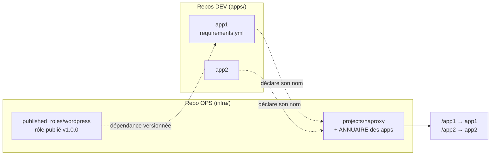

# 6 — Rôles publiés & routage dynamique (dev / ops)

Suite de [5](5-TERRAFORM-VS-ANSIBLE.md). On sait provisionner une cible et la configurer. Reste
la question **d'organisation** : quand **deux équipes** se partagent le travail, **qui fournit
quoi** ? Ce chapitre monte une **stratégie Ansible complète** entre **dev** et **ops**, avec un
reverse proxy **HAProxy** qui route **N applications** — et qui découvre les nouvelles **tout
seul**.

> **Scénario à réaliser en autonomie.** Vous incarnez successivement les **deux** rôles. Les
> fichiers sont fournis dans
> [`solutions/6-haproxy/`](https://github.com/bngams/2607-ansible-intro/tree/main/solutions/6-haproxy) ;
> l'exercice final consiste à **ajouter une
> application** et à la voir routée **sans toucher au proxy**.

## ✨ Objectifs

- Comprendre les **deux artefacts** qui circulent entre dev et ops.
- **Publier** un rôle Ansible (`meta/main.yml`, version) et le **consommer** via
  `requirements.yml` — le `requirements.yml` du [chapitre 4](4-ROLES.md) devient enfin concret.
- Générer une config HAProxy **depuis un annuaire**, avec `template` + `validate:` + **handler**.
- Ajouter une application au routage en **une ligne**, sans modifier le template.

## Le scénario (deux organisations, deux responsabilités)

- L'**équipe ops** possède l'**infra** : l'entrée du trafic (le proxy) **et** les **standards**
  qu'elle publie sous forme de **rôles réutilisables**.
- Les **équipes dev** possèdent **leurs applications** : chacune son repo, son cycle de release.
  Elles ne réécrivent pas l'installation d'un WordPress — elles **consomment** le rôle des ops.

**Deux artefacts circulent**, et c'est tout le sujet du chapitre :

| Sens | Artefact | Ce que ça résout |
|---|---|---|
| **ops => dev** | un **rôle publié** (`wordpress`, épinglé `v1.0.0`) | les devs héritent d'un standard **maintenu et versionné** au lieu de copier-coller |
| **dev => ops** | le **nom de l'application** | les ops **exposent** l'app sans rien savoir de son contenu |



## 📁 L'arborescence cible

```
infra/                               # LES OPS
├── published_roles/
│   ├── wordpress/                   # le rôle publié (meta/, defaults/, tasks/, templates/)
│   └── publish.sh                   # "publier" = versionner + taguer
└── projects/
    └── haproxy/
        ├── inventory.ini            # L'ANNUAIRE : le groupe [apps]
        ├── site.yml
        └── roles/haproxy/           # template + handler + validate
apps/                                # LES DEVS (un repo par application)
├── app1/                            # consomme le rôle wordpress
│   ├── requirements.yml
│   ├── install-deps.sh
│   └── site.yml
└── app2/                            # l'application à ajouter (exercice)
```

> **Imaginez trois dépôts Git.** `infra/`, `apps/app1/` et `apps/app2/` sont côte à côte
> uniquement pour que le TP tienne dans un dossier. En vrai : **trois repos**, **trois équipes**,
> **trois cycles de vie**.

### Ressources utiles

- [Rôles](https://docs.ansible.com/ansible/latest/playbook_guide/playbooks_reuse_roles.html) ·
  [`meta/main.yml`](https://docs.ansible.com/ansible/latest/playbook_guide/playbooks_reuse_roles.html#role-dependencies)
- [`ansible-galaxy` (installer des rôles)](https://docs.ansible.com/ansible/latest/galaxy/user_guide.html)
- [Configuration HAProxy](https://docs.haproxy.org/) (frontend / backend / ACL)

---

## 📦 1 — Côté OPS : publier un rôle

Un rôle « privé » vit dans `roles/` à côté d'un playbook. Un rôle **publié** est un **livrable** :
il a une **identité**, une **version**, et un **contrat** (ses variables). La différence tient à
un fichier — sans lui, `ansible-galaxy` refuse de l'installer.

🚧 **À compléter** — `infra/published_roles/wordpress/meta/main.yml`

```yaml
galaxy_info:
  role_name: wordpress
  namespace: ops
  author: equipe-ops
  description: Deploie WordPress (Apache + PHP) sur une cible Debian.
  license: MIT
  min_ansible_version: "2.12"
  platforms:
    - name: Debian
      versions:
        - bookworm
dependencies: []        # TODO : un rôle publié peut lui-même dépendre d'autres rôles
```

| Élément | Rôle |
|---|---|
| `meta/main.yml` | **obligatoire** pour être installable — c'est la carte d'identité du rôle |
| `defaults/main.yml` | le **contrat public** : ce que les devs ont le droit de surcharger |
| `platforms` | les OS supportés — un dev sait tout de suite si le rôle le concerne |

> **⚠️ Piège — sans `meta/main.yml`, rien ne s'installe.**
> ```text
> [WARNING]: - wordpress was NOT installed successfully:
>            this role does not appear to have a meta/main.yml file.
> ```
> **Correctif** => créez le fichier ci-dessus. C'est **précisément** ce qui distingue un dossier
> `roles/` d'un rôle **publiable**.

**Publier** = versionner et taguer. En entreprise, un `git push` sur GitLab ; ici, un dépôt local :

```bash
cd solutions/6-haproxy/infra/published_roles
./publish.sh          # git init + commit + tag v1.0.0
```

> 💡 **Tester**
> ```text
> Role publie : .../infra/published_roles/wordpress
> Version     : v1.0.0
> ```

---

## 🔗 2 — Côté DEV : consommer le rôle publié

L'équipe dev **ne réécrit pas** l'installation de WordPress. Elle la **déclare en dépendance**,
en **épinglant la version** — comme un `package.json` ou un `terraform init`.

🚧 **À compléter** — `apps/app1/requirements.yml`

```yaml
roles:
  - name: wordpress
    src: git+file://__OPS_REPO__/infra/published_roles/wordpress
    version: v1.0.0          # TODO : pourquoi épingler plutôt que suivre la branche ?

collections:
  - name: community.docker
```

Le playbook du dev se réduit alors à **appliquer** le rôle, en surchargeant ce dont il a besoin :

```yaml
# apps/app1/site.yml
- name: Deployer WordPress avec le role des ops
  hosts: app1
  gather_facts: true
  vars:
    wordpress_site_title: "App1 - WordPress"   # surcharge du contrat public
    wordpress_db_host: db
  roles:
    - wordpress
```

> **⚠️ Piège — `git+file://` exige un chemin ABSOLU.** Un chemin relatif est interprété comme un
> nom de rôle Galaxy :
> ```text
> sorry, ../../infra/published_roles/wordpress was not found on https://galaxy.ansible.com/api/.
> ```
> **Correctif** => le script `install-deps.sh` résout la racine du lab et substitue
> `__OPS_REPO__`. **En entreprise, ce problème n'existe pas** : `src:` pointe simplement sur
> `git+https://gitlab.example.com/ops/ansible-role-wordpress.git`.

> 💡 **Tester** — depuis `apps/app1/` :
> ```bash
> docker compose up -d          # la cible applicative + sa base
> ./install-deps.sh             # récupère le rôle publié par les ops
> ansible-playbook -i inventory.ini site.yml
> ```
> ```text
> - wordpress (v1.0.0) was installed successfully
> app1  : ok=12   changed=9    unreachable=0    failed=0
> ```

> **À retenir.** On **versionne `requirements.yml`**, **jamais** les rôles téléchargés (d'où le
> `.gitignore` sur `roles/wordpress/`). En CI, `install-deps.sh` précède `ansible-playbook`.

---

## 📇 3 — Côté OPS : l'annuaire des applications

C'est la pièce centrale. Le proxy ne connaît pas les applications **en dur** : il les lit dans un
**annuaire**, et **la route dérive du nom de l'hôte**.

🚧 **À compléter** — `infra/projects/haproxy/inventory.ini`

```ini
# Chaque hôte du groupe [apps] devient AUTOMATIQUEMENT une route /<hostname>.
[apps]
app1 ansible_connection=community.docker.docker
# TODO (exercice) : ajouter app2 ici

[proxy]
proxy ansible_connection=community.docker.docker
```

| Convention | Conséquence |
|---|---|
| l'hôte s'appelle `app1` | il est exposé sur **`/app1`** |
| il appartient au groupe `[apps]` | il est **pris en compte** par le proxy |
| rien d'autre à déclarer | **aucun** fichier de route, **aucune** négociation de chemin |

> **Pourquoi dériver la route du nom ?** Parce que c'est le **contrat le plus léger possible** :
> le dev n'a rien à écrire de plus que le nom de son application, et l'ops n'a rien à inventer.
> Un nom **unique** suffit à garantir une route **unique**.

---

## 🧩 4 — Le template : générer la config depuis l'annuaire

Le template ne cite **aucune** application : il **boucle** sur le groupe `[apps]`.

🚧 **À compléter** — `roles/haproxy/templates/haproxy.cfg.j2` (extrait)

```jinja
frontend http_in
    bind *:{{ haproxy_listen_port }}


    acl is_{{ app }} path_beg /{{ app }}



    use_backend {{ app }}_be if is_{{ app }}


    default_backend {{ haproxy_default_app }}_be


backend {{ app }}_be
    balance {{ haproxy_balance_method }}
    # TODO : pourquoi cette redirection AVANT le strip ? (indice : chemin vide)
    http-request redirect code 301 location /{{ app }}/ if { path /{{ app }} }
    http-request set-path %[path,regsub(^/{{ app }},)]
    server {{ app }} {{ app }}:{{ haproxy_backend_port }} check

```

| Directive | Rôle |
|---|---|
| `acl is_X path_beg /X` | **nomme une condition** : « le chemin commence par `/X` » |
| `use_backend X_be if is_X` | **aiguille** vers le backend correspondant |
| `set-path … regsub(^/X,)` | **retire le préfixe** avant de transmettre (`/X/y` -> `/y`) |
| `check` | *health check* : un backend malade est **sorti** de la rotation |

> **⚠️ Piège — `/app2` sans slash final renvoie HTTP 400.** Le strip du préfixe produit un chemin
> **vide**, donc une requête invalide — visible dans les logs du backend :
> ```text
> "GET  HTTP/1.1" 400
> ```
> **Correctif** => rediriger `/app2` vers `/app2/` **avant** le strip (la ligne `redirect`
> ci-dessus).

Le rôle applique ensuite les réflexes du [chapitre 4](4-ROLES.md) — `validate:` puis **handler** :

```yaml
- name: Deployer la configuration generee depuis l'annuaire
  ansible.builtin.template:
    src: haproxy.cfg.j2
    dest: /etc/haproxy/haproxy.cfg
    mode: "0644"
    validate: haproxy -c -f %s     # refuse une config cassée AVANT de l'écrire
  notify: Recharger HAProxy
```

> **⚠️ Piège — le `reload` ne reprend pas la config.** Le script init de HAProxy s'appuie sur
> `ps`, absent d'une image `debian:12`. **Correctif** => installer **`procps`** avec HAProxy (et,
> pour ce lab, un `restart` plutôt qu'un `reload` ; en prod on préfère le `reload`, sans coupure).

> 💡 **Tester** — depuis `infra/projects/haproxy/` :
> ```bash
> docker compose up -d
> ansible-playbook -i inventory.ini site.yml
> curl -sL -o /dev/null -w '%{http_code}\n' http://localhost:8088/app1
> ```
> ```text
> 200
> ```

---

## 🎉 Challenge final — ajouter `app2` sans toucher au proxy

C'est l'aboutissement : une **nouvelle équipe dev** arrive avec son application. Combien de
fichiers l'ops doit-il modifier ? **Un seul, d'une ligne.**

1. **DEV** — démarrez l'application :
   ```bash
   cd apps/app2 && docker compose up -d
   ```
2. **OPS** — déclarez-la dans l'**annuaire** (`infra/projects/haproxy/inventory.ini`) :
   ```ini
   [apps]
   app1 ansible_connection=community.docker.docker
   app2 ansible_connection=community.docker.docker    # <- LA seule modification
   ```
3. **OPS** — rejouez :
   ```bash
   cd infra/projects/haproxy && ansible-playbook -i inventory.ini site.yml
   ```

> 💡 **Vérifier**
> ```bash
> curl -sL http://localhost:8088/app2         # -> Server name: <hostname du conteneur>
> curl -sL http://localhost:8088/app2/hello   # -> URI: /hello  (préfixe retiré)
> ```

- [ ] `/app1` répond (WordPress, déployé par le **rôle des ops**).
- [ ] `/app2` répond — **sans** avoir modifié le template ni le rôle `haproxy`.
- [ ] Vous savez dire **quel artefact** circule dans **quel sens**.

> **⚠️ Si `/app2` ne répond pas tout de suite** : le `check` considère un backend qui vient de
> démarrer comme **DOWN**. Patientez quelques secondes — c'est le *health check* qui fait son
> travail, pas une erreur de config.

## ✅ Bonus

- **Un port différent** : exposez une app qui n'écoute pas sur 80 (surchargez `haproxy_backend_port`,
  ou définissez `app_port` sur l'hôte dans l'inventaire).
- **Load-balancing** : ce chapitre fait du **routage** (N apps **différentes**). Pour répartir la
  charge, il faut **N instances identiques** de la *même* app dans un backend => plusieurs
  `server` + `balance roundrobin`. Ne confondez pas les deux.
- **Rôle Galaxy** : remplacez le rôle `haproxy` maison par
  [`geerlingguy.haproxy`](https://github.com/geerlingguy/ansible-role-haproxy). Attention, il
  **exige les facts** (`ansible_os_family`) => il faut **deux plays** (bootstrap Python sans
  facts, puis le rôle). Vous y gagnez un rôle maintenu, vous y perdez la maîtrise du template.

## Récap

- **Deux artefacts circulent** : les ops **publient des rôles** (versionnés), les devs
  **déclarent leurs applications**. C'est ça, une stratégie Ansible d'équipe.
- Un rôle **publiable** = un rôle avec **`meta/main.yml`** + une **version** ; on versionne
  **`requirements.yml`**, pas les rôles téléchargés.
- L'**annuaire** (le groupe `[apps]`) est la **source de vérité** du routage : la route **dérive
  du nom de l'hôte**.
- Le template **boucle** sur l'annuaire => ajouter une app = **une ligne**, **zéro** modification
  du proxy. Le tout sécurisé par **`validate:`** et rejoué par un **handler**.
- **Pattern universel** : ce qui vaut pour HAProxy vaut pour un **LB**, un **pare-feu**, un
  **switch** — seuls le **template** et le *connection plugin* changent.

➡️ **[7 — GitOps « pull » : réconciliation continue (AWX / Semaphore)](7-GITOPS-AWX.md)** :
prendre du recul sur le **push** (notre lab) vs le **pull** GitOps, et lancer un contrôleur Ansible.
