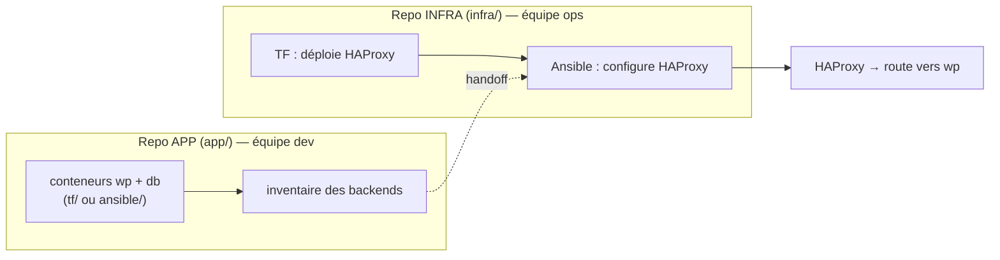

# 6 — Configurer un reverse proxy (HAProxy) avec Ansible

Suite de [5](5-TERRAFORM-VS-ANSIBLE.md). Les conteneurs WordPress + DB tournent, et on a un
**inventaire**. On souhaite mettre un **reverse proxy** (**HAProxy**) devant WordPress : c'est
l'entrée unique qui route le trafic vers l'application. Et on le **configure**, dans notre cas,
**avec Ansible** : c'est l'aboutissement de tout ce qu'on a vu (template, handler, rôle, variables).

> **Pourquoi un reverse proxy ?** Un point d'entrée unique : router selon l'URL/le domaine,
> terminer le TLS, exposer plusieurs apps derrière une seule adresse, **répartir la charge**
> (load-balancing) entre plusieurs instances. Ici on fait le cas de base : **proxy vers une
> instance WordPress**.

## Le scénario (deux équipes, deux projets)

On se met dans une situation **réaliste** :

- L'**équipe dev** a livré des **conteneurs à déployer** (l'app WordPress + sa base) — c'est le
  projet **`app/`**, qui publie aussi l'**inventaire des backends**.
- L'**équipe ops** (vous) possède **son propre projet** : le projet **`infra/`**, avec **son**
  reverse proxy HAProxy. Vous le **déployez** (Terraform) **et** le **configurez** (Ansible) en
  **récupérant les infos de l'inventaire** publié par dev.

> **Imaginez deux dépôts Git séparés.** `app/` et `infra/` ne sont pas deux sous-dossiers d'un même
> projet : ce sont **deux repos distincts**, avec **deux équipes**, **deux cycles de vie** et
> **deux droits d'accès**. Ici on les met côte à côte uniquement pour que le TP tienne dans un
> seul dossier. Le seul **contrat** entre eux = l'**inventaire des backends** publié par `app/`.

C'est le **workflow GitOps** classique : deux flux distincts (dev *et* ops), chacun avec **son
repo**, qui convergent vers l'environnement déployé.


> Schéma inspiré du *« GitOps Workflow »* de Red Hat (DEV → code repo → CI → registry → déploiement ;
> OPS → config repo → déploiement) : [illustration](https://i.ytimg.com/vi/vajIf17ngws/maxresdefault.jpg).

*(C'est le rôle de l'**ops** — son **config repo** — qu'on incarne dans ce chapitre.)* Concrètement
pour notre lab :



> **La portée dépasse HAProxy.** Configurer un **équipement d'entrée à partir de données
> d'inventaire** est un pattern ops **universel** : la même démarche Ansible vaudrait pour un
> **load balancer**, un **pare-feu** (templater des règles ACL/NAT), un **switch/routeur**
> (Cisco/Arista)… **Seuls le template et le *connection plugin* changent** (cf. la table des
> connexions en [0](0-SETUP.md) : `docker`, `ssh`, `network_cli`…). HAProxy n'est qu'un
> exemple **concret et exécutable** de ce pattern.

> **⚠️ Note sur les conteneurs.** Dans ce chapitre, on **configure des conteneurs en cours
> d'exécution** avec Ansible. En pratique, vu le **cycle de vie** d'un conteneur (immuable,
> jetable), on intègre souvent cette config **dans l'image** (Dockerfile) ou le **compose**.
> Ici, on traite le conteneur comme une **abstraction de machine** (VM/serveur) — c'est tout
> l'intérêt du *connection plugin* (cf. [0](0-SETUP.md)) : la **démarche Ansible est
> identique** quel que soit le type de cible.

### Ressources utiles

- [Module `template`](https://docs.ansible.com/ansible/latest/collections/ansible/builtin/template_module.html) ·
  [Rôles](https://docs.ansible.com/ansible/latest/playbook_guide/playbooks_reuse_roles.html)
- [Configuration HAProxy](https://docs.haproxy.org/) (frontend / backend)

---

## Anatomie d'une config HAProxy

Deux blocs essentiels — c'est le vocabulaire **ops** que la config exprime :

| Bloc | Rôle | Ce qu'on y règle |
|---|---|---|
| **`frontend`** *(ingress)* | **par où ça entre** : l'écoute | port/IP d'écoute, **ACL** (règles de routage par domaine/chemin), quel backend cibler |
| **`backend`** *(vers les apps)* | **où ça part** : les serveurs cibles | la liste des **serveurs** (nos conteneurs), l'algo de **répartition**, les *health checks* |

```
client ──▶ frontend (écoute :80, ACL)  ──▶ backend (serveurs)  ──▶ conteneur WordPress
```

> **Et le load-balancing ?** Il suffit de mettre **plusieurs `server`** dans le backend +
> `balance roundrobin` → HAProxy répartit. Ici on fait **un seul backend** (une instance WP).

---

## Le template `haproxy.cfg.j2`

On **génère** un template de config HAProxy avec Ansible (Jinja2) et des **variables**, pour le
rendre **« paramétrable »** :

```jinja
global
    daemon

defaults
    mode http
    timeout connect 5s
    timeout client 30s
    timeout server 30s

# --- INGRESS : par où le trafic entre ---
frontend http_in
    bind *:{{ haproxy_listen_port }}
    default_backend wordpress_app

# --- BACKEND : vers l'application ---
backend wordpress_app
    server wp1 {{ wp_backend_host }}:{{ wp_backend_port }} check
```

> `{{ wp_backend_host }}` = le **hostname du conteneur WordPress** (nom résolu sur le réseau
> Docker).
> `check` = active un *health check* basique.
> Tout est **paramétrable** via les variables. Par exemple, on peut changer le port d'écoute ou
> la cible sans réécrire la config.

---

## Le rôle `haproxy`

On applique les bonnes pratiques de [4](4-ROLES.md), en créant un **rôle** propre à
l'installation et la configuration de HAProxy. *(On peut repartir de `ansible-galaxy role init
roles/haproxy` pour générer l'arborescence.)*

`roles/haproxy/defaults/main.yml` :

```yaml
haproxy_listen_port: 80
wp_backend_host: wp        # le conteneur WordPress (5)
wp_backend_port: 80
```

`roles/haproxy/tasks/main.yml` :

```yaml
- name: Installer HAProxy
  ansible.builtin.apt:
    name: haproxy
    state: present
    update_cache: true

- name: Déployer la configuration (template)
  ansible.builtin.template:
    src: haproxy.cfg.j2
    dest: /etc/haproxy/haproxy.cfg
    mode: "0644"
    validate: haproxy -c -f %s      # /!\ refuse une config invalide AVANT de l'écrire
  notify: Recharger HAProxy

- name: Démarrer et activer HAProxy
  ansible.builtin.service:
    name: haproxy
    state: started
    enabled: true
```

`roles/haproxy/handlers/main.yml` :

```yaml
- name: Recharger HAProxy
  ansible.builtin.service:
    name: haproxy
    state: reloaded
```

> **`validate:`** est un réflexe ops : Ansible lance `haproxy -c -f` sur le fichier rendu **avant**
> de le déployer → une config cassée **n'atteint jamais** le serveur. Inestimable en prod.

---

## Les deux projets (fournis clé en main)

Tout est dans `solutions/6-haproxy/` :

```
app/               # REPO 1 — DEV : la stack applicative livrée
  ├─ tf/           -> wpnet + db + wp, et publie inventory-backends.ini
  └─ ansible/      -> MEME résultat en Ansible (compose.yml + up.yml) — au choix
infra/             # REPO 2 — OPS : votre projet
  ├─ tf/           -> déploie VOTRE conteneur HAProxy (sur wpnet, :8088)
  ├─ ansible/      -> MEME provisioning en Ansible (compose.yml + up.yml)
  │                   + rôle haproxy maison + site.yml + inventory
  └─ ansible-galaxy/ -> BONUS : le même résultat avec un rôle Galaxy
```

> **Pourquoi `tf/` ET `ansible/` dans `app/` ?** Comme au [chapitre 5](5-TERRAFORM-VS-ANSIBLE.md),
> **les deux voies produisent le même résultat** (mêmes conteneurs `db`/`wp`, même réseau `wpnet`,
> même inventaire publié). On met Terraform en avant pour le provisioning, mais si vous travaillez
> plutôt côté Ansible, **prenez `app/ansible/`** — la suite du chapitre est identique. C'est le
> **contrat de sortie** (l'inventaire des backends) qui compte, pas l'outil qui l'a produit.

### Etape 1 — DEV (repo `app/`) : la stack applicative

Au choix, **une** des deux voies — le résultat est le même :

```bash
# Voie Terraform
cd solutions/6-haproxy/app/tf
terraform init && terraform apply -auto-approve     # crée db + wp, écrit inventory-backends.ini
cat inventory-backends.ini                          # l'inventaire des backends, publié pour l'ops
```

```bash
# Voie Ansible (équivalente)
cd solutions/6-haproxy/app/ansible
ansible-playbook up.yml                             # même stack + même inventory-backends.ini
cat inventory-backends.ini
```

### Etape 2 — OPS (repo `infra/`) : déployer votre HAProxy

On change de projet : on quitte `app/` pour **`infra/`**, le repo de l'équipe ops. Là encore,
**deux voies au choix** :

```bash
# Voie Terraform
cd ../../infra/tf
terraform init && terraform apply -auto-approve     # crée le conteneur "proxy" (debian:12, :8088, sur wpnet)
```

```bash
# Voie Ansible (équivalente) — provisionne le proxy ET construit l'inventaire
cd ../../infra/ansible
ansible-playbook up.yml
```

> **Nuance importante.** Le `up.yml` d'`infra/` ne fait pas la même chose que celui d'`app/` :
> `app/` **publie** un inventaire (il livre ses backends), tandis qu'`infra/` le **consomme** et y
> **ajoute son propre hôte `proxy`**. Il détecte tout seul si dev a publié depuis `app/tf/` ou
> `app/ansible/`. Si vous prenez cette voie, l'**étape 3 est déjà faite**.

### Etape 3 — OPS (repo `infra/`) : récupérer l'inventaire

C'est le **handoff** entre les deux repos. L'inventaire de l'ops
(`infra/ansible/inventory.ini`) = les **backends récupérés de dev** + l'**hôte `proxy`** que vous
administrez. On le construit en **récupérant** le fichier publié par dev :

```bash
cd ../ansible
# repartir des backends publiés par dev (adaptez tf/ ou ansible/ selon l'étape 1) :
cp ../../app/tf/inventory-backends.ini inventory.ini
printf '\n[proxy]\nproxy ansible_connection=community.docker.docker\n' >> inventory.ini
```

> En conditions réelles, ce `cp` **n'existe pas** : les deux repos étant séparés, dev **publie**
> son inventaire (artefact de CI, dépôt d'artefacts, inventaire dynamique) et ops le **consomme**.
> Le `cp` est notre raccourci de TP pour matérialiser ce contrat.

*(Une version prête est déjà fournie dans `infra/ansible/inventory.ini`.)*

---

## Le playbook (OPS)

Le `proxy` est un `debian:12` **minimal** → on **réutilise le rôle `bootstrap_python`** de
[1](1-FIRST-PLAYBOOK.md)/[4](4-ROLES.md) avant le rôle `haproxy`. Le conteneur est sur
le réseau `wpnet`, donc il joint `wp` par son nom (lu dans l'inventaire).

```yaml
# infra/ansible/site.yml
- name: Reverse proxy devant WordPress
  hosts: proxy
  gather_facts: false       # pas de facts tant que Python n'est pas amorcé (cf. 1)
  roles:
    - bootstrap_python      # image minimale → amorcer Python (cf. 1/ 4)
    - haproxy
```

> **⚠️ Piège — ni Python, ni `sudo` dans un conteneur minimal.** Deux réflexes « VM » qui cassent
> ici :
> - **`become: true`** => `module_stderr: "/bin/sh: 1: sudo: not found"`. Un `debian:12` nu n'a
>   **pas** de `sudo`… et on y est **déjà root**. **Correctif** => pas de `become`.
> - **`gather_facts`** (actif par défaut) s'exécute **avant** les rôles, donc **avant**
>   `bootstrap_python` => `No python interpreters found for host 'proxy'`. **Correctif** =>
>   `gather_facts: false`, exactement comme le `bootstrap.yml` du [chapitre 1](1-FIRST-PLAYBOOK.md).

> **🧪 Manip — proxy vers WordPress**
>
> 1. **Dev** (Etape 1) → `db`, `wp`, `inventory-backends.ini`. **Ops** (Etapes 2-3) → conteneur
>    `proxy` + inventaire.
> 2. `ansible-playbook -i inventory.ini site.yml` → HAProxy installé + configuré.
> 3. Vérifiez que le proxy **route vers WordPress** :
>    ```bash
>    curl -s -o /dev/null -w '%{http_code} -> %{redirect_url}\n' http://localhost:8088
>    ```
>    ```text
>    302 -> http://127.0.0.1:8088/wp-admin/install.php
>    ```
>    La **redirection vers l'installeur WordPress** prouve que le trafic a bien traversé HAProxy
>    jusqu'au backend `wp`.
>
>    > **⚠️ Si vous obtenez `500`** : ce n'est **pas** HAProxy (il a bien relayé), c'est
>    > **WordPress qui ne joint pas sa base**. Sans `WORDPRESS_DB_USER`/`WORDPRESS_DB_PASSWORD`,
>    > WP tente `root` **sans mot de passe** alors que MySQL exige `rootpw`. Les fichiers fournis
>    > passent déjà ces variables ; vérifiez avec `docker exec wp env | grep WORDPRESS_DB`.
> 4. Changez `haproxy_listen_port` ou une règle → rejouez → le **handler recharge** HAProxy
>    (et `validate` bloquerait une config invalide). Rejouez sans rien changer → `changed=0`.
>
> *Observation : un point d'entrée unique, configuré **par du code**, devant l'application — et
> rechargé seulement quand sa config bouge.*
>
> **Nettoyage** — dans l'ordre **infra puis app**, avec la commande de la voie choisie :
> - voie Terraform => `terraform destroy -auto-approve` dans `infra/tf`, puis dans `app/tf` ;
> - voie Ansible => `docker compose down` dans `infra/ansible`, puis `docker compose down -v`
>   dans `app/ansible` (c'est `app/` qui possède le réseau `wpnet`).

---

## Aller plus loin (mentions)

- **Load-balancing** : ajoutez des `server wp2 …`, `server wp3 …` dans le backend +
  `balance roundrobin` → HAProxy répartit la charge. L'**inventaire des backends** (publié par
  dev) peut **lister plusieurs hôtes** → on boucle dessus dans le template :
  ```jinja
  backend wordpress_app
      balance roundrobin
  
      server {{ h }} {{ h }}:80 check
  
  ```
- **Routage par domaine/chemin** (ACL) : `acl is_blog hdr(host) -i blog.example.com` +
  `use_backend …` → plusieurs apps derrière un seul HAProxy.
- **TLS** : terminer le HTTPS sur le `frontend` (`bind *:443 ssl crt …`).

> Ces variantes ne changent pas l'approche : **une config templatée + un handler**. C'est tout
> l'intérêt — l'ops devient du **code versionné, testable, rejouable**.

---

## ✅ Bonus — le même résultat avec un rôle Galaxy (`requirements.yml`)

Jusqu'ici on a **écrit** notre rôle : c'était l'objectif (template Jinja2, `validate:`, handler).
Mais en vrai, **on n'écrit pas tout soi-même** : le rôle
[`geerlingguy.haproxy`](https://github.com/geerlingguy/ansible-role-haproxy) fait déjà le travail.
C'est l'occasion de rendre **concret** le `requirements.yml` vu au [chapitre 4](4-ROLES.md).

On déclare la dépendance, **en épinglant la version** :

```yaml
# infra/ansible-galaxy/requirements.yml
collections:
  - name: community.docker
roles:
  - name: geerlingguy.haproxy
    version: 1.3.2            # reproductible : on epingle
```

```bash
cd solutions/6-haproxy/infra/ansible-galaxy
ansible-galaxy install -r requirements.yml -p ./roles
```

Et on **ne configure plus que des variables** — aucun template à écrire :

```yaml
# infra/ansible-galaxy/site.yml (extrait)
- name: Configurer HAProxy avec le rôle Galaxy
  hosts: proxy
  gather_facts: true          # indispensable : le rôle teste ansible_os_family
  vars:
    haproxy_frontend_name: http_in
    haproxy_frontend_port: 80
    haproxy_backend_name: wordpress_app
    haproxy_backend_balance_method: roundrobin
    haproxy_backend_servers:
      - name: wp1
        address: wp:80
  roles:
    - geerlingguy.haproxy
```

> **⚠️ Piège — le rôle Galaxy exige les facts.** Il teste `ansible_os_family`, mais nos conteneurs
> minimaux n'ont **pas** Python, donc pas de facts (cf. le piège plus haut). Si vous gardez
> `gather_facts: false`, vous obtenez :
> ```text
> Error while evaluating conditional: 'ansible_os_family' is undefined
> ```
> **Correctif** => **deux plays** : le premier amorce Python **sans** facts
> (`bootstrap_python`), le second active `gather_facts: true` pour le rôle Galaxy.

| | Rôle **maison** | Rôle **Galaxy** |
|---|---|---|
| Ce qu'on écrit | le template `haproxy.cfg.j2` + les tâches | **uniquement des variables** |
| Ce qu'on apprend | template, `validate:`, handler | **consommer** et **versionner** une dépendance |
| Maîtrise de la config | **totale** (c'est votre fichier) | limitée aux variables exposées par le rôle |
| Maintenance | à votre charge | suivie par l'auteur (mais **vous subissez** ses choix) |
| *Health check* | à ajouter soi-même | `option httpchk` **fourni** |

> **Que choisir ?** Ni l'un ni l'autre systématiquement. Un rôle Galaxy éprouvé fait gagner du
> temps sur un besoin **standard** ; un rôle maison reste préférable dès que la config est
> **spécifique** ou que vous devez en **maîtriser chaque ligne**. Ici, le rôle maison **reste le
> fil rouge** du chapitre — c'est lui qui vous apprend le métier.

> 💡 **Tester** — avec la stack `app/` démarrée et le conteneur `proxy` provisionné :
> ```bash
> cp ../ansible/inventory.ini .
> ansible-playbook -i inventory.ini site.yml
> curl -s -o /dev/null -w '%{http_code} -> %{redirect_url}\n' http://localhost:8088
> ```
> ```text
> 302 -> http://127.0.0.1:8088/wp-admin/install.php
> ```

> **À retenir.** On **versionne `requirements.yml`**, **jamais** les rôles téléchargés (d'où le
> `.gitignore` sur `roles/geerlingguy.*`). En CI, `ansible-galaxy install -r requirements.yml`
> précède `ansible-playbook` — comme un `npm install` ou un `terraform init`.

---

## Recap

- **Scénario réaliste, deux repos** : **dev livre** l'app (repo **`app/`** + l'inventaire des
  backends) ; **ops possède son edge** (repo **`infra/`** : il déploie HAProxy et le configure
  depuis l'inventaire récupéré). Des **deux côtés**, le provisioning est au choix **`tf/`** ou
  **`ansible/`** — c'est le **contrat** (l'inventaire), pas l'outil, qui compte.
- **HAProxy** = reverse proxy : `frontend` (**ingress** : écoute + routage) → `backend`
  (**les serveurs** cibles).
- Config **générée par Ansible** (template Jinja2) + **`validate:`** (refuse une config cassée)
  + **handler** (reload uniquement sur changement) — le tout dans un **rôle**.
- Cas de base : **un backend** (WordPress). Load-balancing = **plusieurs `server` + `balance`**.
- **Pattern universel** : configurer un équipement d'entrée (proxy, LB, **pare-feu**, switch…)
  depuis l'inventaire — seuls **template** et **connection plugin** changent.
- **Bonus** : le même résultat via **`geerlingguy.haproxy`** (Galaxy) => `requirements.yml`
  **versionné et épinglé**, rôles téléchargés **jamais commités**.

➡️ **[7 — GitOps « pull » : réconciliation continue (AWX / Semaphore)](7-GITOPS-AWX.md)** :
prendre du recul sur le **push** (notre lab) vs le **pull** GitOps, et lancer un contrôleur Ansible.
