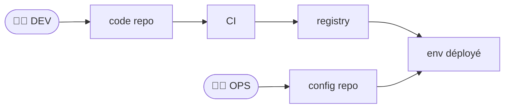
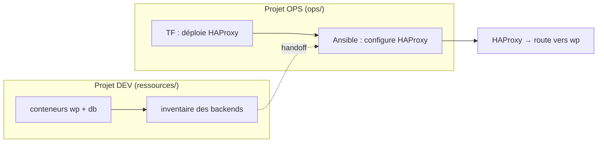

# 6 — Configurer un reverse proxy (HAProxy) avec Ansible

Suite de [5](5-TERRAFORM-VS-ANSIBLE.md). Les conteneurs WordPress + DB tournent, et on a un
**inventaire**. On souhaite mettre un **reverse proxy** (**HAProxy**) devant WordPress : c'est
l'entrée unique qui route le trafic vers l'application. Et on le **configure**, dans notre cas,
**avec Ansible** : c'est l'aboutissement de tout ce qu'on a vu (template, handler, rôle, variables).

> **Pourquoi un reverse proxy ?** Un point d'entrée unique : router selon l'URL/le domaine,
> terminer le TLS, exposer plusieurs apps derrière une seule adresse, **répartir la charge**
> (load-balancing) entre plusieurs instances. Ici on fait le cas de base : **proxy vers une
> instance WordPress**.

## Le scénario (deux équipes, deux projets)

On se met dans une situation **réaliste** :

- L'**équipe dev** a livré des **conteneurs à déployer** (l'app WordPress + sa base) — c'est le
  dossier **`ressources/`**, qui publie aussi l'**inventaire des backends**.
- L'**équipe ops** (vous) possède **son propre projet/infra** : **son** reverse proxy HAProxy.
  Vous le **déployez** (Terraform) **et** le **configurez** (Ansible) en **récupérant les infos
  de l'inventaire** publié par dev.

C'est le **workflow GitOps** classique : deux flux distincts (dev *et* ops), chacun avec **son
repo**, qui convergent vers l'environnement déployé.



> Schéma inspiré du *« GitOps Workflow »* de Red Hat (DEV → code repo → CI → registry → déploiement ;
> OPS → config repo → déploiement) : [illustration](https://i.ytimg.com/vi/vajIf17ngws/maxresdefault.jpg).

*(C'est le rôle de l'**ops** — son **config repo** — qu'on incarne dans ce chapitre.)* Concrètement
pour notre lab :



> **La portée dépasse HAProxy.** Configurer un **équipement d'entrée à partir de données
> d'inventaire** est un pattern ops **universel** : la même démarche Ansible vaudrait pour un
> **load balancer**, un **pare-feu** (templater des règles ACL/NAT), un **switch/routeur**
> (Cisco/Arista)… **Seuls le template et le *connection plugin* changent** (cf. la table des
> connexions en [0](0-SETUP.md) : `docker`, `ssh`, `network_cli`…). HAProxy n'est qu'un
> exemple **concret et exécutable** de ce pattern.

> **⚠️ Note sur les conteneurs.** Dans ce chapitre, on **configure des conteneurs en cours
> d'exécution** avec Ansible. En pratique, vu le **cycle de vie** d'un conteneur (immuable,
> jetable), on intègre souvent cette config **dans l'image** (Dockerfile) ou le **compose**.
> Ici, on traite le conteneur comme une **abstraction de machine** (VM/serveur) — c'est tout
> l'intérêt du *connection plugin* (cf. [0](0-SETUP.md)) : la **démarche Ansible est
> identique** quel que soit le type de cible.

### Ressources utiles

- [Module `template`](https://docs.ansible.com/ansible/latest/collections/ansible/builtin/template_module.html) ·
  [Rôles](https://docs.ansible.com/ansible/latest/playbook_guide/playbooks_reuse_roles.html)
- [Configuration HAProxy](https://docs.haproxy.org/) (frontend / backend)

---

## Anatomie d'une config HAProxy

Deux blocs essentiels — c'est le vocabulaire **ops** que la config exprime :

| Bloc | Rôle | Ce qu'on y règle |
|---|---|---|
| **`frontend`** *(ingress)* | **par où ça entre** : l'écoute | port/IP d'écoute, **ACL** (règles de routage par domaine/chemin), quel backend cibler |
| **`backend`** *(vers les apps)* | **où ça part** : les serveurs cibles | la liste des **serveurs** (nos conteneurs), l'algo de **répartition**, les *health checks* |

```
client ──▶ frontend (écoute :80, ACL)  ──▶ backend (serveurs)  ──▶ conteneur WordPress
```

> **Et le load-balancing ?** Il suffit de mettre **plusieurs `server`** dans le backend +
> `balance roundrobin` → HAProxy répartit. Ici on fait **un seul backend** (une instance WP).

---

## Le template `haproxy.cfg.j2`

On **génère** un template de config HAProxy avec Ansible (Jinja2) et des **variables**, pour le
rendre **« paramétrable »** :

```jinja
global
    daemon

defaults
    mode http
    timeout connect 5s
    timeout client 30s
    timeout server 30s

# --- INGRESS : par où le trafic entre ---
frontend http_in
    bind *:{{ haproxy_listen_port }}
    default_backend wordpress_app

# --- BACKEND : vers l'application ---
backend wordpress_app
    server wp1 {{ wp_backend_host }}:{{ wp_backend_port }} check
```

> `{{ wp_backend_host }}` = le **hostname du conteneur WordPress** (nom résolu sur le réseau
> Docker).
> `check` = active un *health check* basique.
> Tout est **paramétrable** via les variables. Par exemple, on peut changer le port d'écoute ou
> la cible sans réécrire la config.

---

## Le rôle `haproxy`

On applique les bonnes pratiques de [4](4-ROLES.md), en créant un **rôle** propre à
l'installation et la configuration de HAProxy. *(On peut repartir de `ansible-galaxy role init
roles/haproxy` pour générer l'arborescence.)*

`roles/haproxy/defaults/main.yml` :

```yaml
haproxy_listen_port: 80
wp_backend_host: wp        # le conteneur WordPress (5)
wp_backend_port: 80
```

`roles/haproxy/tasks/main.yml` :

```yaml
- name: Installer HAProxy
  ansible.builtin.apt:
    name: haproxy
    state: present
    update_cache: true

- name: Déployer la configuration (template)
  ansible.builtin.template:
    src: haproxy.cfg.j2
    dest: /etc/haproxy/haproxy.cfg
    mode: "0644"
    validate: haproxy -c -f %s      # /!\ refuse une config invalide AVANT de l'écrire
  notify: Recharger HAProxy

- name: Démarrer et activer HAProxy
  ansible.builtin.service:
    name: haproxy
    state: started
    enabled: true
```

`roles/haproxy/handlers/main.yml` :

```yaml
- name: Recharger HAProxy
  ansible.builtin.service:
    name: haproxy
    state: reloaded
```

> **`validate:`** est un réflexe ops : Ansible lance `haproxy -c -f` sur le fichier rendu **avant**
> de le déployer → une config cassée **n'atteint jamais** le serveur. Inestimable en prod.

---

## Les deux projets (fournis clé en main)

Tout est dans `solutions/6-haproxy/` :

```
ressources/        # DEV : la stack applicative livrée
  └─ *.tf          → wpnet + db + wp, et publie inventory-backends.ini
ops/               # OPS : votre projet
  ├─ tf/           → déploie VOTRE conteneur HAProxy (sur wpnet, :8088)
  └─ ansible/      → rôle haproxy + playbook + inventory (backends + proxy)
```

### Etape 1 — DEV : la stack applicative

```bash
cd solutions/6-haproxy/ressources
terraform init && terraform apply -auto-approve     # crée db + wp, écrit inventory-backends.ini
cat inventory-backends.ini                          # l'inventaire des backends, publié pour l'ops
```

### Etape 2 — OPS : déployer votre HAProxy

```bash
cd ../ops/tf
terraform init && terraform apply -auto-approve     # crée le conteneur "proxy" (debian:12, :8088, sur wpnet)
```

### Etape 3 — OPS : récupérer l'inventaire

L'inventaire de l'ops (`ops/ansible/inventory.ini`) = les **backends récupérés de dev** +
l'**hôte `proxy`** que vous administrez. On peut le construire en **récupérant** le fichier
publié par dev :

```bash
cd ../ansible
# repartir des backends publiés par dev, et y ajouter notre proxy :
cp ../../ressources/inventory-backends.ini inventory.ini
printf '\n[proxy]\nproxy ansible_connection=community.docker.docker\n' >> inventory.ini
```

*(Une version prête est déjà fournie dans `ops/ansible/inventory.ini`.)*

---

## Le playbook (OPS)

Le `proxy` est un `debian:12` **minimal** → on **réutilise le rôle `bootstrap_python`** de
[1](1-FIRST-PLAYBOOK.md)/[4](4-ROLES.md) avant le rôle `haproxy`. Le conteneur est sur
le réseau `wpnet`, donc il joint `wp` par son nom (lu dans l'inventaire).

```yaml
# ops/ansible/site.yml
- name: Reverse proxy devant WordPress
  hosts: proxy
  become: true
  roles:
    - bootstrap_python      # image minimale → amorcer Python (cf. 1/ 4)
    - haproxy
```

> **🧪 Manip — proxy vers WordPress**
>
> 1. **Dev** (Etape 1) → `db`, `wp`, `inventory-backends.ini`. **Ops** (Etapes 2-3) → conteneur
>    `proxy` + inventaire.
> 2. `ansible-playbook -i inventory.ini site.yml` → HAProxy installé + configuré.
> 3. Vérifiez que le proxy **route vers WordPress** :
>    ```bash
>    curl -s -I http://localhost:8088 | head -1     # → HTTP/1.1 200/302 (servi via HAProxy → wp)
>    ```
> 4. Changez `haproxy_listen_port` ou une règle → rejouez → le **handler recharge** HAProxy
>    (et `validate` bloquerait une config invalide). Rejouez sans rien changer → `changed=0`.
>
> *Observation : un point d'entrée unique, configuré **par du code**, devant l'application — et
> rechargé seulement quand sa config bouge.*
>
> Nettoyage : `terraform destroy -auto-approve` dans **`ops/tf`** puis dans **`ressources/`**.

---

## Aller plus loin (mentions)

- **Load-balancing** : ajoutez des `server wp2 …`, `server wp3 …` dans le backend +
  `balance roundrobin` → HAProxy répartit la charge. L'**inventaire des backends** (publié par
  dev) peut **lister plusieurs hôtes** → on boucle dessus dans le template :
  ```jinja
  backend wordpress_app
      balance roundrobin
  
      server {{ h }} {{ h }}:80 check
  
  ```
- **Routage par domaine/chemin** (ACL) : `acl is_blog hdr(host) -i blog.example.com` +
  `use_backend …` → plusieurs apps derrière un seul HAProxy.
- **TLS** : terminer le HTTPS sur le `frontend` (`bind *:443 ssl crt …`).

> Ces variantes ne changent pas l'approche : **une config templatée + un handler**. C'est tout
> l'intérêt — l'ops devient du **code versionné, testable, rejouable**.

---

## Recap

- **Scénario réaliste** : **dev livre** l'app (`ressources/` + inventaire des backends) ;
  **ops possède son edge** (`ops/` : TF déploie HAProxy, Ansible le configure depuis l'inventaire).
- **HAProxy** = reverse proxy : `frontend` (**ingress** : écoute + routage) → `backend`
  (**les serveurs** cibles).
- Config **générée par Ansible** (template Jinja2) + **`validate:`** (refuse une config cassée)
  + **handler** (reload uniquement sur changement) — le tout dans un **rôle**.
- Cas de base : **un backend** (WordPress). Load-balancing = **plusieurs `server` + `balance`**.
- **Pattern universel** : configurer un équipement d'entrée (proxy, LB, **pare-feu**, switch…)
  depuis l'inventaire — seuls **template** et **connection plugin** changent.

➡️ **[FINAL — le capstone](../FINAL/README.md)** : assembler provision (TF/Ansible) +
configuration (Ansible) dans le **pipeline** (on complète la brique du J1).
