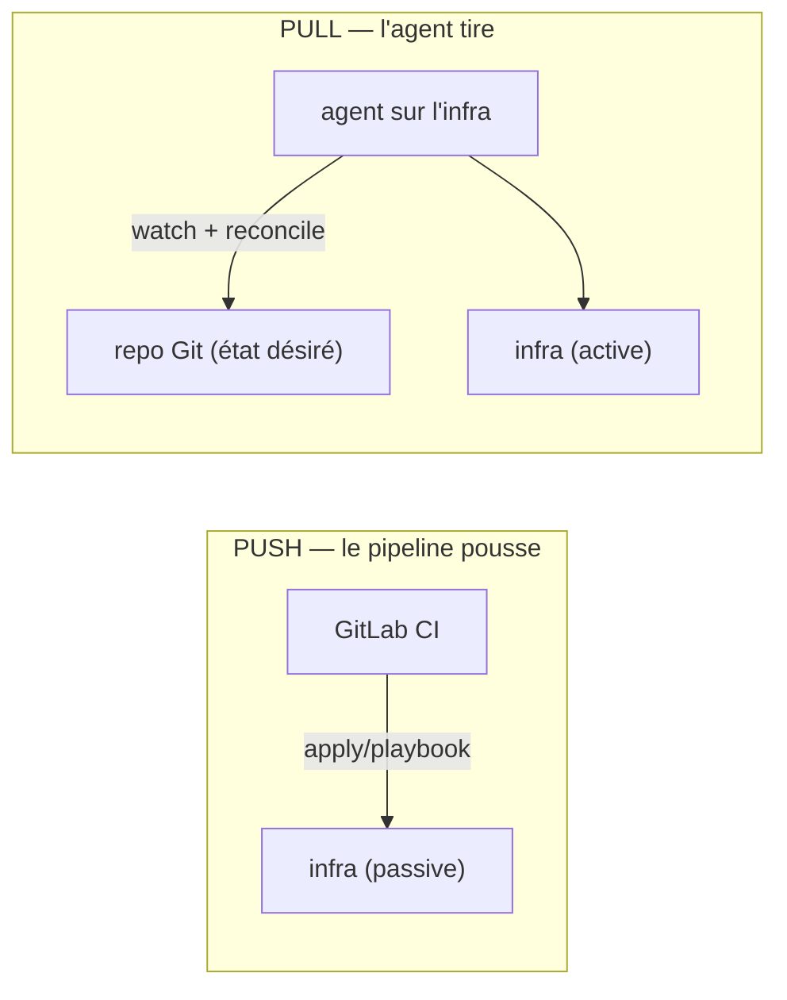

# 7 — GitOps « pull » : réconciliation continue (AWX / Semaphore)

Suite de [6](6-HAPROXY.md). On sait **provisionner** et **configurer**. Jusqu'ici, **c'est nous**
(ou le pipeline GitLab CI) qui **poussons** les changements vers l'infra. Ce dernier chapitre prend
du recul : on regarde l'**autre stratégie**, le **pull GitOps**, où un **agent installé sur
l'infra surveille le repo** et **tire** la config dès qu'elle change — la **réconciliation
continue**.

> **Scénario à réaliser en autonomie.** C'est le **chapitre de clôture** : moins de codes à trou,
> plus de réflexion. Vous lancez un **contrôleur GitOps** (une UI type AWX) via un simple
> `compose.yml`, vous lui branchez un **repo Git**, et vous observez la **synchronisation
> automatique**. Le tout `solution/` est dans `solutions/7-gitops-awx/` — en dernier recours.

## ✨ Objectifs

- Distinguer **push** (ce qu'on a fait tout le J3) et **pull** (GitOps de réconciliation).
- Situer les **outils** du paysage : Argo CD / Flux, **Ansible AWX / AAP**, Terraform Cloud —
  et savoir **pourquoi AWX est aujourd'hui inconfortable** à auto-héberger.
- **Lancer un contrôleur** Ansible (UI web) en un `compose.yml`, y créer un **projet Git**, un
  **template de job** et un **planning** => obtenir une réconciliation périodique.
- Savoir **pourquoi notre lab reste en push** (GitLab CI) — et quand le pull vaut le coût.

## 📁 Point de départ

Un seul dossier à créer, `gitops/`, avec le `compose.yml` du contrôleur :

```text
gitops/
├── compose.yml          # le contrôleur GitOps (UI Ansible) + sa base
├── .env.example         # secrets d'exemple (à copier en .env, gitignoré)
└── demo-repo/           # le "repo surveillé" : un playbook trivial + inventaire
    ├── site.yml
    └── inventory.ini
```

> Le `demo-repo/` **simule le repo Git** que le contrôleur va tirer. En vrai, ce serait votre
> **config repo** ops (le projet `infra/projects/haproxy` du chapitre 6) hébergé sur GitLab/GitHub.

---

## 🔁 1 — Push vs pull : deux façons de converger

C'est le cœur conceptuel du chapitre. Reprenons ce qu'on **fait déjà** avant d'introduire le pull.

**Push (notre lab, DevOps « classique »).** Le pipeline (GitLab CI) s'exécute sur un changement,
se connecte à l'infra et **applique** : `terraform apply`, `ansible-playbook`. L'infra est
**passive**, elle **subit** le déploiement.

**Pull (GitOps de réconciliation).** Un **agent tourne sur/à côté de l'infra**. Il **surveille le
repo** et, dès que l'état déclaré change, il **tire** et **réconcilie** — en continu. L'infra est
**active**, elle **va chercher** son état désiré.



> **La différence clé, c'est le mode d'utilisation.** En push, la source de vérité (le repo) est
> **lue par le pipeline** qui agit de l'extérieur. En pull, la source de vérité est **lue par
> l'infra elle-même**, qui corrige en permanence l'écart entre « ce qui est déclaré » et « ce qui
> tourne » (le *drift*). C'est ça, la **réconciliation continue**.

---

## 🧰 2 — Le paysage des outils GitOps

Avant de manipuler, replaçons AWX parmi ses voisins. Chaque outil vise une **cible** différente.

| Outil | Stratégie | Cible | Coût / réalité |
|---|---|---|---|
| **Argo CD / Flux** | pull (réconciliation) | **Kubernetes uniquement** | gratuit, mais **nécessite un cluster k8s** |
| **Ansible AWX / AAP** | pull (sync de projet Git, *schedules*) | **serveurs / conteneurs** (Ansible) | AWX gratuit mais **lourd** (k8s) et **releases en pause** depuis 07/2024 ; **AAP** (Red Hat) payant et supporté |
| **Semaphore UI** | pull (sync Git, *schedules*) | **serveurs / conteneurs** (Ansible) | gratuit, **léger** (un binaire + une base), activement publié |
| **Terraform Cloud** | pull (*runs* déclenchés par le VCS) | infra **Terraform** | *free tier* (côté provision) |

> **À retenir.** Le vrai pull-GitOps industriel est surtout **Kubernetes** (Argo/Flux). Côté
> **Ansible**, l'équivalent « s'abonner au repo » est **AWX/AAP** — puissant, mais **lourd à
> héberger**, et dont la version libre est **en refonte** (voir la section suivante) ;
> **Semaphore UI** en est l'alternative légère. Pour de l'infra **non-k8s** sans gros outillage,
> un **pipeline planifié** ou un **cron** qui rejoue le playbook suffit à obtenir une
> réconciliation périodique.

> 📖 [Argo CD](https://argo-cd.readthedocs.io/) · [Flux](https://fluxcd.io/) ·
> [Ansible AWX](https://github.com/ansible/awx) · [Terraform Cloud](https://developer.hashicorp.com/terraform/cloud-docs)

---

## ⚠️ 3 — Le cas AWX : lourd à héberger… et en pause

On voudrait lancer **AWX** en un `compose.yml`, comme nos stacks précédentes. **Deux mauvaises
nouvelles**, et elles sont **indépendantes** :

**1. AWX n'est plus supporté hors Kubernetes.** Depuis la v18, le seul chemin officiel est
l'**AWX Operator** sur un cluster k8s. Le compose « dev/test » du dépôt `ansible/awx` se **génère
via un playbook** et embarque une pile complète (web, task, receptor, postgres, redis) — trop
lourd et trop fragile pour un TP.

**2. Le projet est en pause.** Le dépôt affiche un avertissement sans ambiguïté : la **dernière
version date du 2 juillet 2024**, et les **releases sont suspendues** le temps d'une
**refonte de grande ampleur** (passage à une architecture orientée services).

> *« Releases of this project are now paused during a large scale refactoring. »*
> — avertissement en tête du dépôt [ansible/awx](https://github.com/ansible/awx)

> **Symptôme** => vous cherchez un `docker compose up` officiel pour AWX et ne trouvez qu'un
> installeur k8s (`awx-operator`) ou un compose « à générer » ; et la dernière release remonte à
> **plus de deux ans**.
> **Cause** => AWX cible **Kubernetes** (le mono-hôte Docker n'est pas un mode supporté), **et**
> le projet est **gelé** pendant sa refonte.
> **Correctif** => pour **voir et comprendre** le modèle pull côté Ansible sans monter un cluster
> ni dépendre d'un projet en transition, on utilise une **alternative légère** qui, elle, se lance
> vraiment en compose : **Semaphore UI**. Les **concepts sont identiques** (projet Git, template
> de job, inventaire, planning).

> **⚖️ Ce que ça ne veut PAS dire.** AWX n'est **pas** mort : c'est l'**upstream** de *Red Hat
> Ansible Automation Platform*, qui reste, lui, un **produit commercial soutenu**. La pause
> concerne les **releases de l'upstream libre** pendant la refonte. Autrement dit : en entreprise
> **sous souscription Red Hat**, la question ne se pose pas (vous utilisez AAP) ; c'est
> l'**auto-hébergement gratuit d'AWX** qui devient inconfortable aujourd'hui.

> **Deux époques, deux poids.** *AWX / AAP* = la référence Red Hat, riche (RBAC fin, workflows,
> notifications) mais **lourde** (k8s) et actuellement **en refonte**. *Semaphore UI* = même
> **modèle mental** (project => template => run planifié), **beaucoup plus léger** (un binaire Go
> + une base), et **activement publié**. Ici, pour le TP, on prend Semaphore. **En fonction de vos
> contraintes et besoins en entreprise, vous pourrez arbitrer** : souscription AAP ou pas, cluster
> k8s déjà en place ou non, besoin de RBAC fin / workflows / support éditeur, taille de l'équipe
> et coût d'hébergement.

> 📖 [Dépôt AWX (et son avertissement)](https://github.com/ansible/awx) ·
> [AWX : install sur k8s (Operator)](https://ansible.readthedocs.io/projects/awx-operator/) ·
> [Semaphore UI](https://semaphoreui.com/) · [AWX vs Semaphore](https://semaphoreui.com/blog/awx-vs-semaphore)

---

## 🚀 4 — Lancer le contrôleur (compose)

On monte le contrôleur GitOps et sa base. La base garde les projets, templates et plannings ; le
contrôleur expose l'**UI web** sur le port 3000.

Créez `gitops/compose.yml` et complétez les trous :

🚧 **À compléter** — `gitops/compose.yml`

```yaml
services:
  postgres:
    image: postgres:16-alpine
    environment:
      POSTGRES_USER: semaphore
      POSTGRES_PASSWORD: ${DB_PASSWORD:-semaphore_pw}
      POSTGRES_DB: semaphore
    volumes:
      - semaphore_db:/var/lib/postgresql/data
    healthcheck:
      test: ["CMD-SHELL", "pg_isready -U semaphore"]
      interval: 5s
      timeout: 3s
      retries: 10

  semaphore:
    image: semaphoreui/semaphore:v2.18.28   # version epinglee (jamais :latest)
    ports:
      - "127.0.0.1:3000:3000"               # TODO : pourquoi lier au loopback ? (indice : dev)
    volumes:
      - ./demo-repo:/repos/demo-repo:ro     # le repo surveille, monte en LECTURE SEULE
    environment:
      SEMAPHORE_DB_DIALECT: postgres
      SEMAPHORE_DB_HOST: postgres
      SEMAPHORE_DB_PORT: 5432
      SEMAPHORE_DB_USER: semaphore
      SEMAPHORE_DB_PASS: ${DB_PASSWORD:-semaphore_pw}
      SEMAPHORE_DB: semaphore
      SEMAPHORE_ADMIN: admin
      SEMAPHORE_ADMIN_PASSWORD: ${ADMIN_PASSWORD:-changeme}
      SEMAPHORE_ADMIN_NAME: Admin
      SEMAPHORE_ADMIN_EMAIL: admin@example.com
    depends_on:
      postgres:
        condition: service_healthy          # TODO : pourquoi attendre le healthcheck ?
```

Ajoutez le volume nommé sous une clé `volumes:` en fin de fichier :

```yaml
volumes:
  semaphore_db:
```

| Élément | Rôle |
|---|---|
| `postgres` + `healthcheck` | la base du contrôleur ; le healthcheck signale qu'elle **accepte les connexions** |
| `depends_on: condition: service_healthy` | le contrôleur **ne démarre pas** avant que la base soit prête (sinon crash au boot) |
| `image: …:v2.18.28` | **version épinglée** — reproductible, pas de surprise au prochain `pull` |
| `127.0.0.1:3000:3000` | UI liée au **loopback** : accessible en local, **pas exposée** sur le réseau (dev) |
| `SEMAPHORE_ADMIN_*` | crée le **compte admin** au **premier** démarrage |

> 📖 [Semaphore — variables d'environnement](https://docs.semaphoreui.com/administration-guide/docker/)

> 💡 **Tester** — depuis `gitops/` :
> ```bash
> cp .env.example .env        # secrets locaux (gitignorés)
> docker compose up -d
> curl -s http://127.0.0.1:3000/api/ping   # -> pong
> ```
> Au **premier** démarrage, laissez ~15-30 s : le contrôleur crée le schéma en base avant de
> répondre (`curl` peut renvoyer un code vide/`000` le temps que le port réponde). Une fois prêt :
> ```text
> pong
> ```
> Ouvrez ensuite **http://127.0.0.1:3000** et connectez-vous avec **admin / changeme**.

---

## 🔗 5 — Brancher un repo Git et planifier la réconciliation

C'est ici que se joue le **pull**. On déclare au contrôleur **où est l'état désiré** (un repo Git),
**quoi rejouer** (le playbook), **sur quoi** (l'inventaire), puis **quand** (un planning). C'est
exactement le modèle **AWX** : *Project => Template => Schedule*.

> **⚠️ Prérequis — `demo-repo/` doit être un VRAI dépôt Git.** Le contrôleur ne lit pas un
> dossier : il le **clone**. Initialisez-le d'abord, sinon la synchronisation échoue :
> ```bash
> cd demo-repo && git init -q . && git add -A
> git -c user.email=dev@example.com -c user.name=demo commit -qm "playbook de reconciliation"
> ```

Le `demo-repo/` fournit un playbook volontairement trivial — il **prouve** que le contrôleur tire
le repo et rejoue le playbook :

```yaml
# demo-repo/site.yml
- name: Reconciliation demo (pull GitOps)
  hosts: localhost
  connection: local
  gather_facts: false
  tasks:
    - name: Ecrire un marqueur d'execution
      ansible.builtin.copy:
        content: "reconcilie par le controleur GitOps\n"
        dest: /tmp/gitops-reconcile.txt
        mode: "0644"
```

**À vous, dans l'UI** (aux étapes précédentes vous avez été guidé pas à pas ; ici vous suivez la
doc et raisonnez par analogie AWX) :

| Objet à créer | Équivalent AWX | Ce que vous renseignez |
|---|---|---|
| **Key Store** (clé/identifiant) | *Credential* | rien pour un repo public ; sinon une clé SSH/token |
| **Repository** | *Project* | l'URL Git du repo surveillé (ici, votre `demo-repo` poussé sur GitLab/GitHub) |
| **Inventory** | *Inventory* | le contenu de `inventory.ini` |
| **Task Template** | *Job Template* | le playbook `site.yml` + le repo + l'inventaire |
| **Schedule** (cron) | *Schedule* | ex. toutes les 5 min => réconciliation **périodique** |

> **Pourquoi un planning, et pas juste un bouton ?** Un run manuel, c'est du **push déguisé**. Le
> **planning** (ou un webhook Git) est ce qui rend le modèle **pull** : le contrôleur **revient
> tout seul** vérifier et réappliquer l'état désiré — même si personne ne pousse. C'est la
> **réconciliation continue** en pratique.

> 📖 [Semaphore — Projects & Templates](https://docs.semaphoreui.com/user-guide/task-templates/) ·
> [Schedules](https://docs.semaphoreui.com/user-guide/schedule/)

> 💡 **Tester** — lancez le template une fois depuis l'UI, puis vérifiez le marqueur écrit par le
> playbook dans le conteneur du contrôleur :
> ```bash
> docker compose exec semaphore cat /tmp/gitops-reconcile.txt
> # -> reconcilie par le controleur GitOps
> ```
> Activez le **schedule** : le run **repart tout seul** à l'intervalle choisi, sans action de votre
> part. **C'est le pull.**

---

## 🧪 Manip — voir le « pull » corriger un drift

1. Dans l'UI, **activez** un schedule court (ex. toutes les minutes).
2. Dans le conteneur, **simulez un drift** : `docker compose exec semaphore rm -f /tmp/gitops-reconcile.txt`.
3. **Attendez** le prochain run planifié, puis re-testez le `cat` ci-dessus.

Le fichier **réapparaît** sans que vous ayez rien poussé : le contrôleur a **réconcilié** l'écart.
C'est la démonstration, en petit, de ce que font Argo/Flux sur un cluster.

---

## 🎉 Challenge final

- [ ] Le contrôleur répond (`/api/ping` -> `pong`) et l'UI se connecte en **admin**.
- [ ] Un **Repository** (projet Git) est branché.
- [ ] Un **Task Template** rejoue `site.yml` sur l'**inventaire**.
- [ ] Un **Schedule** est actif => le run **repart seul**.
- [ ] La **manip drift** prouve la **réconciliation**.

## ✅ Bonus

- Branchez **le config repo ops du chapitre 6** (`infra/projects/haproxy`) au lieu du `demo-repo` => une vraie
  réconciliation de reverse proxy.
- Remplacez le **schedule** par un **webhook** déclenché au `git push` => réconciliation **sur
  événement** (au plus près du GitOps « temps réel »).
- Comparez avec **Argo CD** sur un mini-cluster (`kind`/`k3d`) si vous voulez voir le pull-GitOps
  **k8s** de référence.

## Récap

- **Push** = le pipeline pousse (notre lab, GitLab CI). **Pull** = l'agent sur l'infra **tire** et
  **réconcilie** en continu.
- Paysage : **Argo/Flux** (k8s), **AWX/AAP** et **Semaphore UI** (Ansible), **Terraform Cloud** (TF).
- **AWX** cumule deux freins : plus supporté **hors k8s**, et **releases en pause depuis
  juillet 2024** (refonte en cours). Le **produit commercial AAP**, lui, reste soutenu.
- => pour un TP on illustre le même modèle (*project => template => schedule*) avec
  **Semaphore UI**, réellement lançable en compose.
- **Notre lab reste en push** (GitLab CI) : **clair, gratuit, suffisant** pour la formation. Le
  pull vaut son coût surtout **sous Kubernetes** ou quand la **réconciliation continue** est un
  vrai besoin.

> **Nettoyage.** Depuis `gitops/` : `docker compose down -v` (supprime aussi le volume de la base).

➡️ **[FINAL — le capstone](../FINAL/README.md)** : assembler provision (TF/Ansible) +
configuration (Ansible) dans le **pipeline** (on complète la brique du J1).
